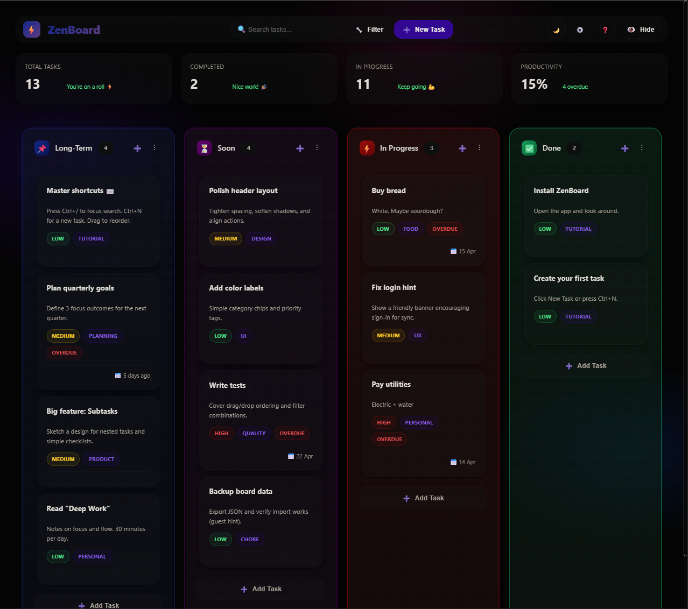

# ZenBoard (Zenflow)

A compact, privacy-first Kanban board built as a Next.js app with a legacy browser-based client.



## Overview

- Uses Next.js 13 + TypeScript.
- Legacy UI and app logic are kept in `src/client/` and bootstrapped by `src/pages/index.tsx`.
- Board data is stored locally in the browser and encrypted with a passphrase.
- Optional Supabase sync is available via a `public/js/config.js` runtime config.

## Run locally

```powershell
npm install
npm run dev
```

Then open http://localhost:3000.

## Optional Supabase sync

Create `public/js/config.js` if you want cloud sync.

```javascript
window.SUPABASE_CONFIG = {
  url: 'https://your-project.supabase.co',
  anonKey: 'your-anon-key'
};
```

Do not commit real keys.

## Notes

- `src/client/bootstrap.ts` loads the legacy client and calls `initClient()`.
- The page uses injected HTML markup so the original DOM-driven code can attach event handlers.
- No automated tests or lint scripts are included yet.

## Build

```powershell
npm run build
npm run start
```
